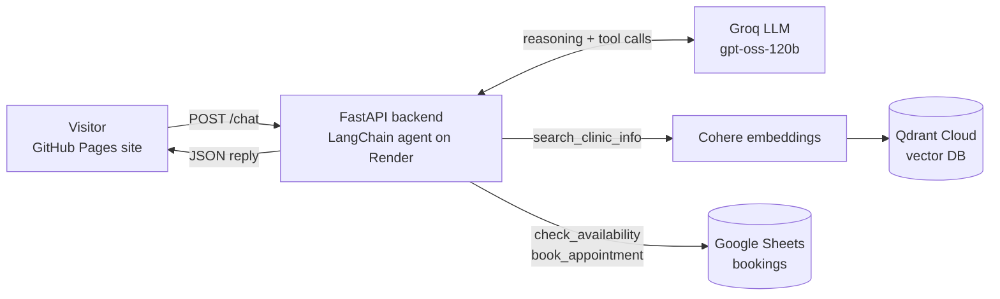

# 🩺 Salman Physio Care — RAG Chatbot

An AI agent for a physiotherapy clinic that answers patient questions about services, fees, packages and timings, and **books appointments** directly into Google Sheets, in **Roman Urdu and English**. It uses Retrieval-Augmented Generation (RAG) so every answer comes from the clinic's own data, and tool calling so it can take actions, with medical safety guardrails built in.

**🔗 Live demo:** https://salu12776.github.io/salman-physio-chatbot/

---

## ✨ Features

- **RAG pipeline**: answers are grounded in the clinic's documents, so the bot does not invent fees or services
- **Agentic appointment booking** with Google Sheets: availability check, validation, duplicate prevention and a confirmation step before every booking
- **Natural date and time understanding**: "Monday 4 baje" or "kal shaam 5" is converted to real slots automatically
- **Bilingual**: understands and replies in Roman Urdu and English, which is how most Pakistani patients actually type
- **Per-user conversation memory**: each visitor gets a separate session with summarised chat history
- **Medical safety guardrails**: never diagnoses or suggests medicines, and directs users with red-flag symptoms (e.g. severe pain after an accident, numbness, weakness) to a doctor or emergency department first
- **Production deployment**: static frontend on GitHub Pages, FastAPI backend on Render, kept warm with uptime monitoring

## 🏗️ Architecture



## 🛠️ Tech Stack

| Layer | Technology |
|---|---|
| Frontend | HTML, CSS, JavaScript (chat widget) on GitHub Pages |
| Backend | Python, FastAPI, Uvicorn |
| Agent framework | LangChain `create_agent` (LangGraph) with tool calling |
| Booking storage | Google Sheets API via `gspread` (service account) |
| Embeddings | Cohere `embed-english-v3.0` |
| Vector database | Qdrant Cloud |
| LLM | `openai/gpt-oss-120b` via Groq |
| Hosting | Render (backend), GitHub Pages (frontend), UptimeRobot (monitoring) |

## 🔒 Security

- API keys are stored only as Render environment variables, and the Google service-account key as a Render secret file, never in the code or the repository
- CORS is restricted to the GitHub Pages domain, so other websites cannot call the backend from a browser
- Rate limiting with `slowapi`: per-user limits (15/minute, 100/day) plus a global limit (500/hour) to protect API credits
- Input validation: messages are capped at 500 characters
- Internal errors are logged on the server and never exposed to users
- In-memory sessions expire after 2 hours and are capped to prevent memory exhaustion
- Booking safeguards: phone number validation, one booking per number per day, max 2 bookings per chat, and no other patient's booking details are ever revealed
- Sheet rows are written as raw text, so user input cannot run as a spreadsheet formula

## 📁 Project Structure

```
├── index.html               # Clinic website with embedded chat widget
├── widget.html              # Standalone chat widget
├── main.py                  # FastAPI backend with RAG pipeline
├── physio_clinic_data.txt   # Clinic knowledge base (services, fees, policies)
├── requirements.txt         # Python dependencies
└── render.yaml              # Render deployment blueprint
```

## 🚀 Run Locally

```bash
git clone https://github.com/salu12776/salman-physio-chatbot.git
cd salman-physio-chatbot
pip install -r requirements.txt
```

Set these environment variables:

```
COHERE_API_KEY=your_cohere_key
GROQ_API_KEY=your_groq_key
QDRANT_URL=your_qdrant_cluster_url
QDRANT_API_KEY=your_qdrant_key
QDRANT_COLLECTION=salman_physio_docs
SHEET_ID=your_google_sheet_id
GOOGLE_CREDENTIALS_FILE=path/to/service-account.json
ALLOWED_ORIGINS=http://localhost:5500
```

Start the server:

```bash
uvicorn main:app --reload
```

## 🔌 API

| Method | Endpoint | Description |
|---|---|---|
| GET | `/` | Health check |
| POST | `/chat` | Send `{"message": "...", "session_id": "..."}`, returns `{"answer": "...", "session_id": "..."}` |
| POST | `/chat/reset?session_id=...` | Clear a session's memory |

## 🗺️ Roadmap

- [x] Appointment booking through tool calling (agentic workflow)
- [ ] Instant email / WhatsApp alert to the clinic for new bookings
- [ ] WhatsApp integration
- [ ] Persistent session memory with Redis
- [ ] Multilingual embeddings for better Roman Urdu retrieval

## 👤 Author

**Salman** — [GitHub](https://github.com/salu12776)
